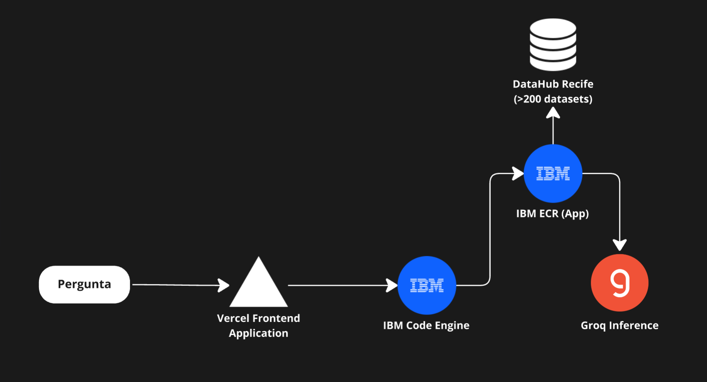
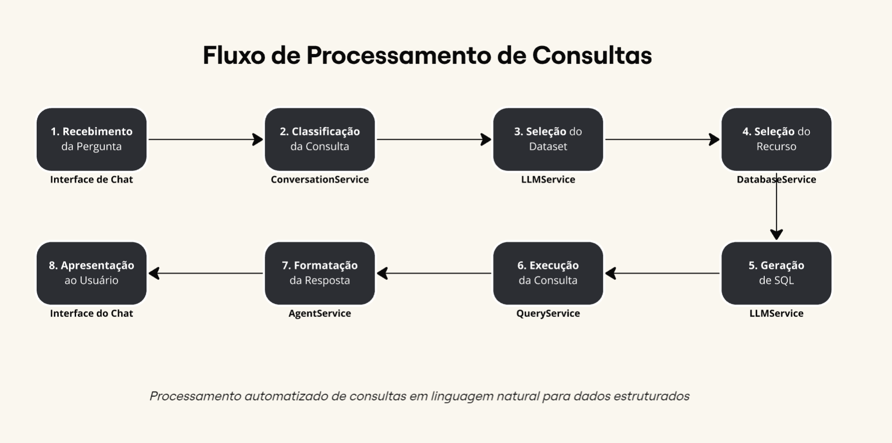

<div align="center">

# VihAI - Transformando dados públicos em inteligência cidadã

  
  
  

</div>

VihAI é uma **plataforma web inovadora desenvolvida para democratizar o acesso aos dados públicos da cidade do Recife**. O projeto utiliza Inteligência Artificial Generativa para permitir que cidadãos consultem e compreendam informações públicas através de linguagem natural, sem necessidade de conhecimentos técnicos em análise de dados ou linguagens de consulta.

A plataforma conecta-se ao [DataHub Recife](http://dados.recife.pe.gov.br) e transforma perguntas cotidianas em consultas técnicas, apresentando os resultados de forma clara e contextualizada. O sistema é construído sobre uma arquitetura de agentes especializados que podem responder a perguntas sobre diferentes aspectos da cidade.


## Arquitetura Técnica



A arquitetura do VihAI foi projetada para ser modular, escalável e centrada na experiência do usuário. O sistema está estruturado em duas partes principais:

- Frontend: Interface web responsiva desenvolvida em React
- Backend: API RESTful desenvolvida em Python com FastAPI

## Fluxo de Processamento



1. O usuário submete uma pergunta em linguagem natural através da interface
2. O backend classifica o tipo de consulta
3. Seleciona o dataset do datahub
4. Seleciona o recurso daquele dataset específico que possa responder a pergunta do usuário
5. O agente transforma a pergunta em consulta técnica SQL
6. A consulta é executada na base de dados pública
7. Os resultados são processados e convertidos em linguagem natural
8. A resposta é apresentada ao usuário de forma contextualizada

## Componentes do Frontend

O frontend do VihAI foi desenvolvido com React 19 e utiliza o framework Tailwind CSS para estilização. A interface foi projetada para ser intuitiva, acessível e responsiva, funcionando bem em dispositivos móveis e desktop.

### Principais Componentes:

- **Painel de Conversação**: Interface de chat para interação com a IA
- **Seleção de Agentes**: Permite escolher especialistas em diferentes domínios
- **Visualização de Dados**: Apresenta os dados de forma contextualizada
- **Modal Explicativo**: Explica o funcionamento do sistema para novos usuários
- **Navegação Simplificada**: Menu lateral com acesso rápido às funcionalidades

### Tecnologias Utilizadas:

- **React 19**: Framework JavaScript para construção da interface
- **Tailwind CSS 4**: Framework de CSS utilitário
- **Lucide Icons**: Biblioteca de ícones
- **React Markdown**: Para renderização de conteúdo formatado

## Componentes do Backend

O backend do VihAI é construído com Python e FastAPI, oferecendo uma API RESTful de alto desempenho. O sistema utiliza um modelo de agentes especializados alimentados por LLMs (Large Language Models) para processar consultas em linguagem natural.

Atualmente os modelos utilizados na aplicação são executados através da API do Groq. Os modelos são: 

- deepseek-r1-distill-llama-70b (Para atividades complexas)
- llama3-8b-8192 (Para conversação simples)

### Principais Componentes:

#### Serviços Core:

- **DatabaseService**: Gerencia conexões e consultas às bases de dados públicas
- **LLMService**: Orquestra a comunicação com modelos de linguagem
- **QueryService**: Executa e otimiza consultas SQL
- **ConversationService**: Gerencia o fluxo de diálogo e contexto das conversas

#### Agentes Especializados:

- **BaseAgent**: Implementação base para todos os agentes especializados
- **CultureAgent (AnaCultura)**: Especializado em eventos culturais e patrimônio
- **HealthAgent (AnaCuida)**: Foco em saúde pública e bem-estar
- **MobilityAgent (AnaMobi)**: Especializado em transporte e mobilidade urbana
- **PublicServicesAgent**: Orientado a serviços municipais e atendimento ao cidadão

#### Tecnologias Utilizadas:

- **Python 3.12**: Linguagem de programação principal
- **FastAPI**: Framework web de alta performance
- **Groq**: Serviço de API para LLMs
- **SQLAlchemy**: ORM para interação com bancos de dados
- **LangChain**: Framework para desenvolvimento de aplicações com LLMs
- **Pydantic**: Validação de dados e configurações

## Configuração e Instalação

### Requisitos de Sistema

- Node.js 18+ (para o frontend)
- Python 3.12+ (para o backend)

#### Instalação Frontend

```bash
# Clone o repositório
git clone https://github.com/Ivi-SCD/vihai.git
cd vihai/frontend

# Instale as dependências
npm install

# Configure as variáveis de ambiente
# Caso você esteja usando Windows você deve criar o arquivo .env na pasta /frontend
touch .env
# Edite o arquivo .env com suas configurações

# Inicie o servidor de desenvolvimento
npm run dev
```

#### Instalação Backend

```bash
# Na pasta raiz do projeto
cd backend

# Crie um ambiente virtual
python -m venv venv
source venv/bin/activate  # No Windows: venv\Scripts\activate

# Instale as dependências
pip install -r requirements.txt

# Configure as variáveis de ambiente
# Caso você esteja usando Windows você deve criar o arquivo .env na pasta /frontend
touch .env
# Edite o arquivo .env com suas configurações

# Inicie o servidor
uvicorn app.main:app --reload
```

### Variáveis de Ambiente

#### Frontend (.env)

```env
VITE_REACT_APP_BACKEND_API_URL=http://localhost:8000
```

#### Backend (.env)

```env
API_URL=http://dados.recife.pe.gov.br/api/3/action
GROQ_API_KEY=sua-chave-api-groq
MODEL_NAME=deepseek-r1-distill-llama-70b
MODEL_CHAT_NAME=llama3-8b-8192
```

## API Endpoints

### Principais Endpoints

| Endpoint | Método | Descrição |
|----------|--------|-----------|
| `/` | GET | Verifica o status da API |
| `/datasets` | GET | Lista todos os datasets disponíveis |
| `/query` | POST | Processa uma consulta de dados |
| `/message` | POST | Processa uma mensagem de conversação |

### Exemplos de Requisições

#### Query Request

```json
POST /query
{
  "query": "Quais são os bairros com mais eventos culturais no Recife?"
}
```

#### Message Request

```json
POST /message
{
  "message": "Onde encontro academias da cidade próximas a Boa Viagem?",
  "conversation_id": "conv_123",
  "tipo_agente": "SAUDE"
}
```

## Agentes Especializados

### AnaCultura (Agente Cultural)

Especializado em:
- Eventos culturais e festivais
- Patrimônio histórico e pontos turísticos
- Equipamentos culturais (teatros, museus, bibliotecas)
- Manifestações culturais populares

### AnaCuida (Agente de Saúde)

Especializado em:
- Unidades de saúde e serviços disponíveis
- Academias da cidade e atividades físicas
- Dados epidemiológicos e campanhas de saúde
- Programas de bem-estar e qualidade de vida

### AnaMobi (Agente de Mobilidade)

Especializado em:
- Transporte público (ônibus, metrô, BRT)
- Ciclovias e mobilidade ativa
- Trânsito e condições das vias
- Projetos de mobilidade urbana

### Agente de Serviços Públicos

Especializado em:
- Serviços municipais e como acessá-los
- Programas sociais e critérios de elegibilidade
- Procedimentos administrativos municipais
- Atendimento ao cidadão e canais de comunicação

## Processo de Desenvolvimento

O VihAI foi desenvolvido seguindo metodologias ágeis, com foco em:

1. **Design Centrado no Usuário**: Interface intuitiva e acessível
2. **Arquitetura Modular**: Componentes independentes e reutilizáveis
3. **Escalabilidade**: Preparado para crescer com a demanda
4. **Segurança**: Boas práticas de segurança e privacidade
5. **Performance**: Otimizado para respostas rápidas mesmo com consultas complexas

## Considerações de Segurança

- O sistema acessa apenas dados públicos oficiais
- Não armazena informações pessoais dos usuários
- Implementa rate limiting para evitar sobrecarga
- Utiliza HTTPS para todas as comunicações
- Validação rigorosa de todas as entradas de usuário

## Limitações Atuais

- Acesso limitado a datasets específicos do DataHub Recife
- Processamento de linguagem natural em português pode ser limitado em consultas muito complexas
- Dependência de serviços externos para LLMs
- Análises limitadas a dados estruturados

## Roadmap Futuro

1. **Expansão de Agentes**: Novos agentes especializados (educação, meio ambiente)
2. **Visualizações Avançadas**: Gráficos e mapas interativos
3. **Personalização**: Perfis de usuário e preferências de consulta
4. **Integração com Serviços**: Conexão com serviços municipais
5. **Multimodalidade**: Suporte a consultas por voz e imagem

## Contribuição

O projeto VihAI está aberto a contribuições da comunidade. Para contribuir:

1. Faça um fork do repositório
2. Crie uma branch para sua feature (`git checkout -b feature/nova-funcionalidade`)
3. Faça commit das suas alterações (`git commit -m 'Adiciona nova funcionalidade'`)
4. Envie para o repositório (`git push origin feature/nova-funcionalidade`)
5. Abra um Pull Request

## Licença

Este projeto está licenciado sob a [Licença MIT](LICENSE).

## Contato

Para mais informações sobre o projeto, pode entrar em contato comigo através do e-mail ivipnascimento@hotmail.com ;)